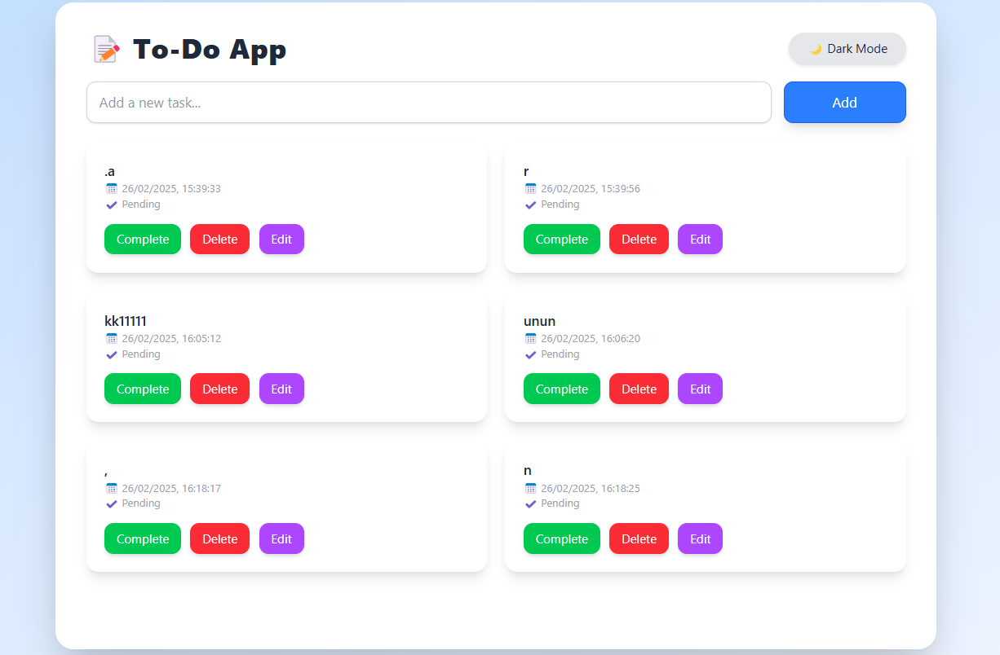
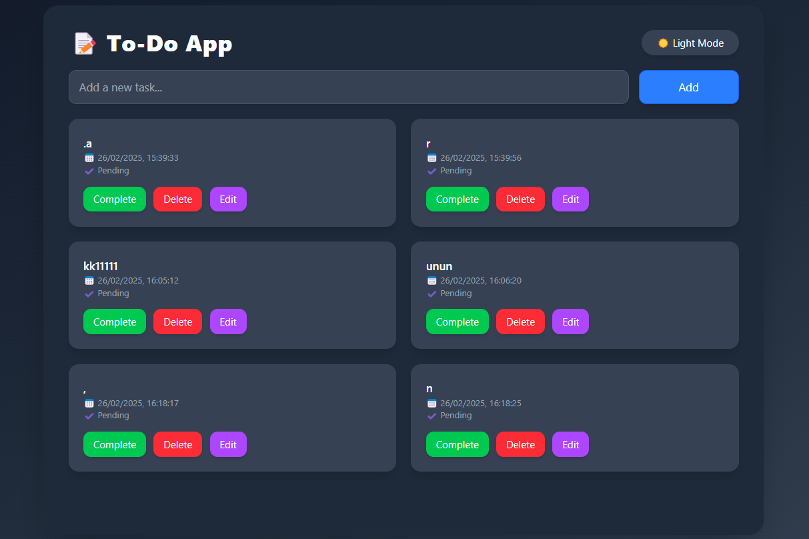

Here’s a **`README.md`** file for your ToDo App project. This file provides an overview of the project, setup instructions, and usage details.

---

# ToDo App

A simple and elegant ToDo application built with **React** (frontend) and **Express** (backend), using **MongoDB** for data storage. The app allows users to create, read, update, and delete tasks, with a dark/light mode toggle for better user experience.

---

## Features

-   **Add Tasks**: Add new tasks with a description.
-   **Edit Tasks**: Update the text of existing tasks.
-   **Mark as Complete**: Toggle tasks between completed and pending.
-   **Delete Tasks**: Remove tasks you no longer need.
-   **Dark/Light Mode**: Switch between dark and light themes.
-   **Persistent Data**: Tasks are saved in MongoDB and persist across page reloads.

---

## Technologies Used

-   **Frontend**:

    -   React
    -   Vite (for fast development)
    -   Tailwind CSS (for styling)
    -   Framer Motion (for animations)
    -   React Toastify (for notifications)

-   **Backend**:
    -   Express.js
    -   MongoDB (for database)
    -   Mongoose (for MongoDB object modeling)
    -   CORS (for handling cross-origin requests)

---

## Prerequisites

Before running the project, ensure you have the following installed:

-   [Node.js](https://nodejs.org/) (v16 or higher)
-   [MongoDB](https://www.mongodb.com/) (running locally or via a cloud service like MongoDB Atlas)

---

## Setup Instructions

### 1. Clone the Repository

```bash
git clone https://github.com/your-username/todo-app.git
cd todo-app
```

### 2. Install Dependencies

#### Frontend

Navigate to the root directory of the project and install dependencies:

```bash
npm install
```

#### Backend

Navigate to the `backend-ToDoApp` folder and install dependencies:

```bash
cd backend-ToDoApp
npm install
```

### 3. Set Up MongoDB

-   Ensure MongoDB is running locally on `mongodb://127.0.0.1:27017`.
-   If using a cloud service, update the `MONGO_URI` in `backend-ToDoApp/server.js` with your connection string.

### 4. Start the Application

#### Option 1: Start Frontend and Backend Separately

-   **Start the Backend**:

    ```bash
    cd backend-ToDoApp
    npm start
    ```

    The backend will run on `http://localhost:3000`.

-   **Start the Frontend**:
    ```bash
    cd ..
    npm run dev
    ```
    The frontend will run on `http://localhost:5174`.

#### Option 2: Start Both with a Single Command

From the root directory, run:

```bash
npm start
```

This will start both the frontend and backend simultaneously using `concurrently`.

---

## Project Structure

```
todo-app/
├── public/                  # Static assets
├── src/                     # Frontend source code
│   ├── components/          # React components
│   ├── App.css              # Global styles
│   ├── App.jsx              # Main React component
│   └── main.jsx             # Entry point
├── backend-ToDoApp/         # Backend source code
│   ├── models/              # Mongoose models
│   ├── server.js            # Express server
│   └── package.json         # Backend dependencies
├── package.json             # Frontend dependencies and scripts
└── README.md                # Project documentation
```

---

## API Endpoints

The backend provides the following RESTful API endpoints:

-   **GET `/api/tasks`**: Fetch all tasks.
-   **POST `/api/tasks`**: Create a new task.
    -   Request Body:
        ```json
        {
            "text": "Your task description"
        }
        ```
-   **PUT `/api/tasks/:id`**: Update a task (text or completion status).
    -   Request Body:
        ```json
        {
            "text": "Updated task description",
            "completed": true
        }
        ```
-   **DELETE `/api/tasks/:id`**: Delete a task.

---

## Screenshots

### Light Mode



### Dark Mode



---

## Contributing

Contributions are welcome! If you'd like to contribute, please follow these steps:

1. Fork the repository.
2. Create a new branch (`git checkout -b feature/your-feature`).
3. Commit your changes (`git commit -m 'Add some feature'`).
4. Push to the branch (`git push origin feature/your-feature`).
5. Open a pull request.

---

## License

This project is licensed under the MIT License. See the [LICENSE](LICENSE) file for details.

---

## Acknowledgments

-   [Vite](https://vitejs.dev/) for the fast development setup.
-   [Tailwind CSS](https://tailwindcss.com/) for the utility-first CSS framework.
-   [Framer Motion](https://www.framer.com/motion/) for animations.
-   [React Toastify](https://fkhadra.github.io/react-toastify/) for notifications.

---

## Contact

For any questions or feedback, feel free to reach out:

-   **Your Name**
-   **Email**: osamakhan99@hotmail.com
-   **GitHub**: [osama999x](https://github.com/osama999x)

---

Enjoy using the ToDo App! 🚀

---

Let me know if you need further assistance! 😊
